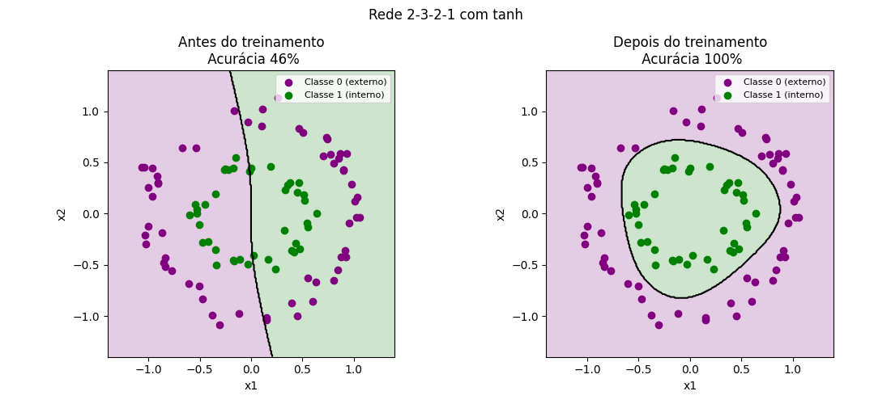
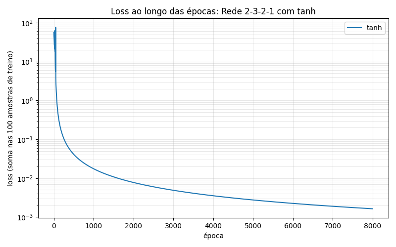
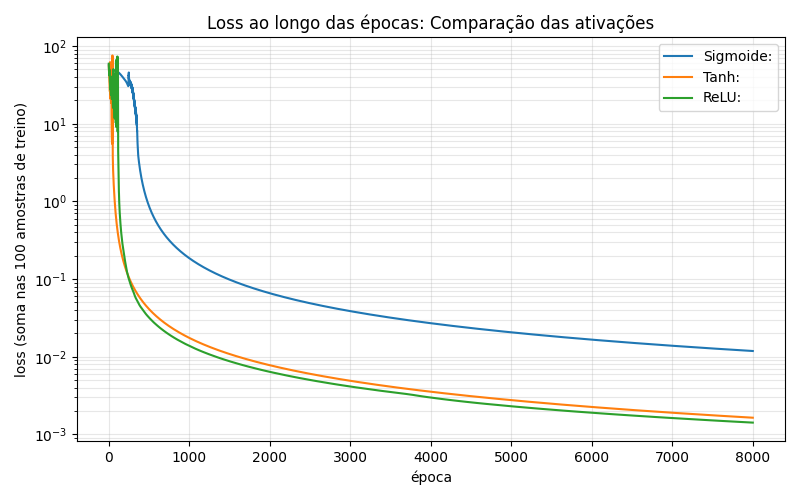

# Rede Neural: Classificação de Círculos

O presente projeto é associado à disciplina de Matemática para Ciência de Dados da Especialização em Deep Learning do Centro de Informática da UFPE.

O objetivo é implementar adaptações em uma rede neural desenvolvida em sala de aula em Python (com NumPy), com forward e backward calculados neurônio a neurônio.


---

## 1. Base de dados

Houve a alteração para o dataset `make_circles` do scikit-learn: dois círculos, um dentro do outro. A rede classifica cada ponto como **interno (classe 1)** ou **externo (classe 0)**.


| Parâmetro | Valor |
|---|---|
| Amostras | 500 |
| Ruído | 0.06 |
| Raio interno / externo | 0.5 |
| Treino | amostras 0 a 99 |
| Teste | amostras 100 a 199 |

---

## 2. Alterações

| Item | Original | Alterado |
|---|---|---|
| Dataset | `make_moons` | `make_circles` |
| Camadas ocultas | 1 | 2 |
| Neurônios ocultos | 2 | 3 e 2 |
| Ativação das ocultas | sigmoide | tanh |
| Ativação da saída | sigmoide | tanh |
| Rótulos no treino | 0 e 1 | -1 e 1 |
| Taxa de aprendizado | 0.1 | 0.01 |
| Épocas | 10000 | 8000 |
| Avaliação | dados de treino | dados de teste |
| Métricas | acurácia | acurácia, loss e erro |

**Arquitetura final:** 2 entradas → 3 neurônios → 2 neurônios → 1 saída | 2 camadas ocultas

---

## 3. Resultados

### 3.1 Antes e depois do treinamento

| | Acurácia | Loss | Erro |
|---|---|---|---|
| Antes | 46% | 0.6174 | 54% |
| Depois | 100% | 0.0005 | 0% |



### 3.2 Loss ao longo das épocas



### 3.3 Comparação entre funções de ativação

| Ativação | Acurácia | Loss | Erro |
|---|---|---|---|
| Sigmoide | 100% | 0.0008 | 0% |
| **Tanh** | **100%** | **0.0005** | **0%** |
| ReLU | 100% | 0.0094 | 0% |



---

## 4. Conclusão

As três funções de ativação classificaram corretamente todos os dados de teste. A **tanh** obteve a menor loss, e a sigmoide foi a que convergiu mais lentamente.

---

## 5. Como executar

```bash
pip install -r requirements.txt
python main.py
```
